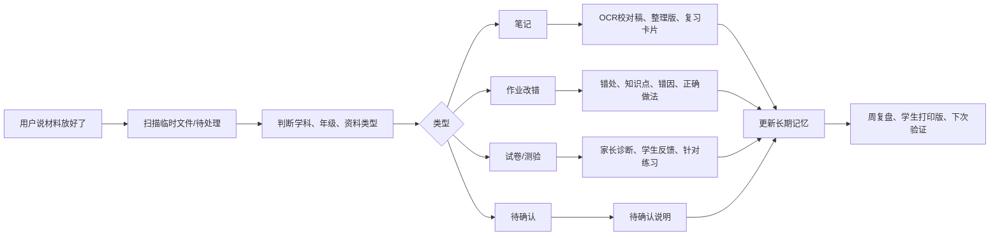
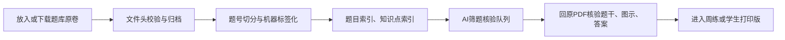

# xuelema

## Purpose

`xuelema` 的定义是：学了吗，先知道学了什么，再知道会不会用。

目标是把学习资料变成一个可持续更新的闭环：资料进入 -> 识别 -> 归档 -> 诊断 -> 追踪 -> 复盘 -> 下次验证。默认面向北京高中生，初中可复用同一套结构，但不硬套高考题源。

## First Steps

1. 确认学习资料库根目录。若用户没有指定，优先使用当前工作目录。
2. 若存在，先读 `学习总索引.md` 或 `高中学习总索引.md`，再读 `长期记忆/总索引.md`。
3. 只有用户明确说材料已放好、可以处理、开始扫描，才处理 `临时文件/待处理`。
4. 不把真实笔记、照片、课件、原卷 PDF、孩子个人资料写入技能仓库；这些只存在用户自己的资料库。

## Core Rules

1. 默认中文输出。
2. 北京高中优先；初中只复用框架，题源和学段标签按实际补充。
3. 笔记、作业改错、试卷三线分开，只通过知识点、错因和长期记忆联动。
4. 题库原卷不上传技能仓库；技能只保留目录模板、规则和脚本。
5. 机器标签只用于筛题，不直接进入孩子版定稿。
6. 正式给孩子看的内容必须核验题干、图示/材料、答案、公式和符号。
7. 不默认自编题；高中优先北京高考真题、北京一模二模、北京学校卷。
8. Markdown 只作归档源稿；给孩子看的正式版本优先 DOCX，必要时再导出 PDF。
9. 每次处理后更新长期记忆，不停留在单次输出。

## Workflow

Read `references/workflows.md` when executing a full note/homework/exam/question-bank/weekly-review workflow. Read `references/print-and-formula.md` before producing student-facing DOCX/PDF. Read `references/privacy-and-release.md` when maintaining the skill repository or preparing a Git release.

## Scripts

Run scripts from the skill directory or with absolute paths. Pass `--root <learning-vault>` unless the current working directory is already the user's learning vault.

- `python -m pip install -r requirements.txt`: install Python dependencies for the scripts.
- `scripts/install_local_skill.py --overwrite`: install this folder into the local Codex skills directory on the current computer.
- `scripts/init_learning_vault.py --target <dir>`: copy the empty learning-vault template.
- `scripts/validate_vault.py --root <dir>`: check the learning-vault structure.
- `scripts/process_inbox.py --root <dir> scan`: list files in `临时文件/待处理`.
- `scripts/process_inbox.py --root <dir> apply-plan plan.json`: move inbox files after the Agent has made and reviewed a JSON plan.
- `scripts/setup_all_subject_question_banks.py --root <dir>`: create six-subject Beijing question-bank skeletons.
- `scripts/tag_mock_questions_all_subjects.py --root <dir>`: create machine question labels from local mock-exam PDFs.
- `scripts/build_ai_question_review_queue.py --root <dir>`: build AI review queues from machine labels.
- `scripts/make_ai_question_review_pack.py --root <dir> --subject 物理 --keywords 机械能`: create a source-checking pack for selected candidate questions.
- `scripts/search_question_bank.py --root <dir> --subjects 数学 --knowledge 立体几何`: search local machine-tagged questions.

Network download helpers are optional and should be used only when the user asks to build or refresh local Beijing mock-exam sources.

## Local Install

If the user copies this folder to another computer without GitHub, install it by placing the whole `xuelema` directory under `~/.codex/skills/` or by running `scripts/install_local_skill.py --overwrite` from inside the copied folder. Restart Codex after installation so the skill is discovered.

## Outputs

- 笔记：`OCR校对稿`、`整理版`、`复习卡片`、`笔记索引`
- 作业改错：`改错诊断`、`错因`、`正确做法`、`复习卡片`
- 试卷：`家长版诊断`、`学生版反馈`、`本周重点`、`针对性练习`
- 周复盘：`家长版周报`、`学生打印版`、`真题练习`、`长期记忆更新`
- 题库：`题目标签索引`、`知识点索引`、`OCR与人工校对清单`、`AI筛题核验队列`
- 长期记忆：`知识点追踪`、`错因追踪`、`笔记追踪`、`作业改错追踪`、`错题-笔记联动表`、`当前重点看板`、`复盘日志`、`规则变更记录`
